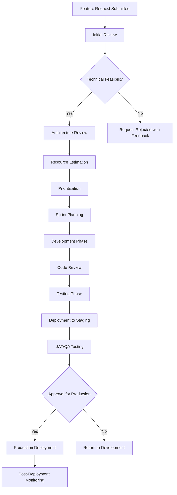

# AWS Containerized Application Reference Architecture

## Table of Contents
1. [High-Level Architecture](#high-level-architecture)
2. [CloudWatch Logging](#cloudwatch-logging)
3. [Key Features and Benefits](#key-features-and-benefits)
4. [New Feature Request Process](#new-feature-request-process)
5. [Tagging Strategy](#tagging-strategy)
6. [Governance and Audit](#governance-and-audit)
7. [Security Considerations](#security-considerations)

---

## 1. High-Level Architecture

### 1.1 Overall System Architecture

```
┌─────────────────────────────────────────────────────────────────┐
│                          Internet/Users                         │
└─────────────────────┬───────────────────────────────────────────┘
                      │
┌─────────────────────▼───────────────────────────────────────────┐
│                    Route 53 (DNS)                              │
│                 SSL/TLS Certificates                           │
└─────────────────────┬───────────────────────────────────────────┘
                      │
┌─────────────────────▼───────────────────────────────────────────┐
│                Application Load Balancer                       │
│              (Shared Infrastructure)                           │
└─────────────────────┬───────────────────────────────────────────┘
                      │
        ┌─────────────┼─────────────┐
        │             │             │
┌───────▼──┐  ┌───────▼──┐  ┌───────▼──┐
│Frontend  │  │Backend   │  │Additional│
│ECS Tasks │  │ECS Tasks │  │Services  │
│          │  │          │  │          │
└───────┬──┘  └───────┬──┘  └───────┬──┘
        │             │             │
┌───────▼──────────────▼─────────────▼──┐
│              Target Groups             │
└────────────────────────────────────────┘
```

### 1.2 Three-Tier Architecture

#### Presentation Tier (Frontend)
- **ECS Fargate Tasks**: Containerized frontend application
- **ECR Repository**: Private container registry for frontend images
- **ALB Target Group**: Routes traffic to frontend containers
- **Auto Scaling**: Horizontal scaling based on CPU/memory metrics

#### Application Tier (Backend)
- **ECS Fargate Tasks**: Containerized backend services/APIs
- **ECR Repository**: Private container registry for backend images
- **ALB Target Group**: Routes API traffic to backend containers
- **Service Discovery**: ECS service discovery for inter-service communication

#### Data Tier
- **Amazon RDS**: Managed relational database (if applicable)
- **Amazon ElastiCache**: In-memory caching layer
- **Amazon S3**: Object storage for static assets and backups

### 1.3 Container Architecture Components

#### Amazon ECS (Elastic Container Service)
- **ECS Clusters**: Logical grouping of compute resources
- **ECS Services**: Maintain desired number of running tasks
- **ECS Tasks**: Individual container instances
- **Task Definitions**: Blueprint for container configuration

#### Amazon ECR (Elastic Container Registry)
- **Private Repositories**: Secure container image storage
- **Image Scanning**: Vulnerability scanning for container images
- **Lifecycle Policies**: Automated image cleanup and retention

#### Application Load Balancer (ALB)
- **Target Groups**: Route traffic to healthy container instances
- **Health Checks**: Monitor container health and availability
- **SSL Termination**: Handle HTTPS encryption/decryption
- **Path-based Routing**: Route requests based on URL paths

### 1.4 Authentication and Authorization

#### Amazon Cognito (Optional)
- **User Pools**: User directory and authentication
- **Identity Pools**: Federated identity access to AWS resources
- **JWT Tokens**: Secure API authentication

#### AWS IAM
- **Task Roles**: Permissions for ECS tasks to access AWS services
- **Execution Roles**: Permissions for ECS to manage tasks
- **Service Roles**: Cross-service permissions
- **Policy-based Access Control**: Fine-grained permission management

---

## 2. CloudWatch Logging

### 2.1 Log Groups Structure

```yaml
Log Group Hierarchy:
├── /aws/ecs/frontend/
│   ├── application-logs
│   ├── access-logs
│   └── error-logs
├── /aws/ecs/backend/
│   ├── application-logs
│   ├── api-logs
│   └── error-logs
├── /aws/applicationloadbalancer/
│   └── access-logs
└── /aws/lambda/ (if applicable)
    └── function-logs
```

### 2.2 Logging Configuration

#### ECS Task Logging
```hcl
# Example Terraform configuration
resource "aws_cloudwatch_log_group" "app_logs" {
  name              = "/aws/ecs/${var.service_name}"
  retention_in_days = var.log_retention_days
  
  tags = local.common_tags
}

# Task Definition logging configuration
logging_configuration = {
  logDriver = "awslogs"
  options = {
    "awslogs-group"         = aws_cloudwatch_log_group.app_logs.name
    "awslogs-region"        = var.aws_region
    "awslogs-stream-prefix" = "ecs"
  }
}
```

#### ALB Access Logging
- **S3 Bucket**: Store ALB access logs for analysis
- **Log Format**: Standard ALB log format with custom fields
- **Retention Policy**: Automated lifecycle management

### 2.3 Log Monitoring and Alerting

#### CloudWatch Metrics
- **Custom Metrics**: Application-specific performance indicators
- **Container Insights**: ECS cluster and service metrics
- **Log-based Metrics**: Extract metrics from log data

#### CloudWatch Alarms
- **Error Rate Monitoring**: Alert on high error rates
- **Performance Degradation**: Monitor response times
- **Resource Utilization**: CPU, memory, and network alerts

---

## 3. Key Features and Benefits

### 3.1 Infrastructure as Code (IaC)

#### Benefits
- **Reproducibility**: Consistent environment provisioning
- **Version Control**: Track infrastructure changes
- **Rollback Capability**: Quick recovery from issues
- **Documentation**: Infrastructure is self-documenting

#### Implementation
- **Modular Design**: Reusable Terraform modules
- **Environment Separation**: Dev, staging, and production isolation
- **State Management**: Centralized Terraform state storage

### 3.2 Containerization Benefits

#### Scalability
- **Horizontal Scaling**: Add/remove container instances based on demand
- **Auto Scaling Policies**: CPU, memory, and custom metric-based scaling
- **Blue/Green Deployments**: Zero-downtime deployments

#### Reliability
- **Health Checks**: Automatic unhealthy container replacement
- **Multi-AZ Deployment**: High availability across availability zones
- **Load Distribution**: Even traffic distribution across containers

#### Security
- **Container Isolation**: Process and network isolation
- **Image Scanning**: Vulnerability detection in container images
- **Secret Management**: AWS Secrets Manager integration

### 3.3 CI/CD Pipeline Benefits

#### Automation
- **Automated Testing**: Unit, integration, and security tests
- **Automated Deployment**: GitHub Actions workflow automation
- **Environment Promotion**: Consistent deployment across environments

#### Quality Assurance
- **Code Quality Gates**: Static code analysis and linting
- **Security Scanning**: Container and dependency vulnerability scanning
- **Approval Workflows**: Manual approval gates for production deployments

---

## 4. New Feature Request Process

### 4.1 Feature Request Workflow



### 4.2 Development Workflow

#### Feature Development
1. **Branch Creation**: Create feature branch from main
2. **Development**: Implement feature with appropriate tests
3. **Local Testing**: Validate functionality locally
4. **Pull Request**: Submit PR with detailed description

#### CI/CD Pipeline Stages
1. **Code Quality Checks**: Linting, formatting, and static analysis
2. **Unit Tests**: Automated test execution
3. **Security Scanning**: Vulnerability and secret detection
4. **Container Build**: Build and push to ECR
5. **Infrastructure Updates**: Terraform plan and apply
6. **Deployment**: Deploy to target environment
7. **Integration Tests**: End-to-end testing
8. **Monitoring**: Post-deployment health checks

### 4.3 Environment Strategy

#### Development Environment
- **Purpose**: Individual developer testing
- **Deployment**: Automatic on feature branch push
- **Resources**: Minimal resource allocation

#### Staging Environment
- **Purpose**: Integration testing and QA
- **Deployment**: Automatic on main branch merge
- **Resources**: Production-like configuration

#### Production Environment
- **Purpose**: Live user traffic
- **Deployment**: Manual approval required
- **Resources**: Full production specifications

---

## 5. Tagging Strategy

### 5.1 Mandatory Tags

```yaml
Standard Tags:
  Environment: 
    - dev
    - staging
    - production
  Project: "project-name"
  Owner: "team-name"
  CostCenter: "cost-center-id"
  Application: "app-name"
  Component:
    - frontend
    - backend
    - shared
  ManagedBy: "terraform"
  CreatedBy: "github-actions"
  Version: "semantic-version"
```

### 5.2 Terraform Tag Implementation

```hcl
# Common tags variable
locals {
  common_tags = {
    Environment   = var.environment
    Project      = var.project_name
    Owner        = var.team_name
    CostCenter   = var.cost_center
    Application  = var.application_name
    Component    = var.component_name
    ManagedBy    = "terraform"
    CreatedBy    = "github-actions"
    Version      = var.application_version
    LastUpdated  = timestamp()
  }
}

# Apply tags to resources
resource "aws_ecs_service" "app" {
  name = var.service_name
  # ... other configuration
  
  tags = local.common_tags
}
```

### 5.3 Tag Governance

#### Automated Tag Enforcement
- **Tag Policies**: AWS Organizations tag policies
- **Required Tags**: Prevent resource creation without mandatory tags
- **Tag Validation**: CI/CD pipeline tag validation

#### Cost Allocation
- **Cost Tracking**: Track costs by environment, project, and component
- **Budget Alerts**: Set up budget alerts based on tags
- **Resource Optimization**: Identify underutilized resources

---

## 6. Governance and Audit

### 6.1 Access Control

#### Repository Access
- **Branch Protection**: Protect main branch from direct pushes
- **Review Requirements**: Mandatory code reviews for all changes
- **Status Checks**: Required CI/CD pipeline success

#### AWS Access
- **IAM Roles**: Principle of least privilege access
- **Cross-Account Roles**: Secure cross-account access patterns
- **MFA Requirements**: Multi-factor authentication for sensitive operations

### 6.2 Compliance and Monitoring

#### AWS CloudTrail
- **API Logging**: Log all AWS API calls
- **Event History**: Maintain audit trail of changes
- **Security Monitoring**: Detect unusual activity patterns

#### Config Rules
- **Compliance Monitoring**: Automated compliance checking
- **Resource Configuration**: Monitor resource configuration drift
- **Remediation**: Automated or manual remediation workflows

### 6.3 Security Scanning

#### Container Security
- **Image Scanning**: ECR vulnerability scanning
- **Runtime Security**: Monitor running containers for threats
- **Compliance Scanning**: CIS benchmark compliance

#### Infrastructure Security
- **Security Groups**: Least privilege network access
- **Encryption**: Encryption at rest and in transit
- **Secrets Management**: AWS Secrets Manager for sensitive data

### 6.4 Backup and Recovery

#### Data Protection
- **RDS Snapshots**: Automated database backups
- **EBS Snapshots**: Volume-level backups
- **Cross-Region Replication**: Disaster recovery preparation

#### Recovery Procedures
- **Recovery Time Objective (RTO)**: Target recovery time
- **Recovery Point Objective (RPO)**: Maximum acceptable data loss
- **Disaster Recovery Testing**: Regular DR testing procedures

---

## 7. Security Considerations

### 7.1 Network Security

#### VPC Configuration
- **Private Subnets**: ECS tasks in private subnets
- **Public Subnets**: Load balancers in public subnets
- **NAT Gateways**: Outbound internet access for private resources

#### Security Groups
```hcl
# ALB Security Group
resource "aws_security_group" "alb" {
  name_prefix = "${var.project_name}-alb-"
  vpc_id      = var.vpc_id

  ingress {
    from_port   = 80
    to_port     = 80
    protocol    = "tcp"
    cidr_blocks = ["0.0.0.0/0"]
  }

  ingress {
    from_port   = 443
    to_port     = 443
    protocol    = "tcp"
    cidr_blocks = ["0.0.0.0/0"]
  }

  egress {
    from_port       = 0
    to_port         = 65535
    protocol        = "tcp"
    security_groups = [aws_security_group.ecs_tasks.id]
  }

  tags = local.common_tags
}

# ECS Tasks Security Group
resource "aws_security_group" "ecs_tasks" {
  name_prefix = "${var.project_name}-ecs-tasks-"
  vpc_id      = var.vpc_id

  ingress {
    from_port       = var.container_port
    to_port         = var.container_port
    protocol        = "tcp"
    security_groups = [aws_security_group.alb.id]
  }

  egress {
    from_port   = 0
    to_port     = 0
    protocol    = "-1"
    cidr_blocks = ["0.0.0.0/0"]
  }

  tags = local.common_tags
}
```

### 7.2 Data Protection

#### Encryption
- **EBS Encryption**: Encrypt container storage
- **RDS Encryption**: Database encryption at rest
- **S3 Encryption**: Object storage encryption
- **Secrets Encryption**: KMS encryption for secrets

#### Data Classification
- **Sensitive Data**: Identify and protect sensitive information
- **Data Retention**: Implement appropriate retention policies
- **Data Access**: Control access to sensitive data

### 7.3 Monitoring and Alerting

#### Security Monitoring
- **GuardDuty**: Threat detection service
- **Security Hub**: Centralized security findings
- **CloudWatch Insights**: Log analysis and alerting

#### Incident Response
- **Incident Playbooks**: Documented response procedures
- **Notification Channels**: Automated alerting mechanisms
- **Forensic Capabilities**: Log retention for investigation

---

## Conclusion

This reference architecture provides a comprehensive foundation for building, deploying, and managing containerized applications on AWS. The modular Terraform approach, combined with robust CI/CD pipelines and comprehensive monitoring, ensures scalable, secure, and maintainable infrastructure.

Key benefits of this architecture include:
- **Scalability**: Automatic scaling based on demand
- **Reliability**: High availability and fault tolerance
- **Security**: Defense-in-depth security strategy
- **Maintainability**: Infrastructure as code and automated deployments
- **Cost Optimization**: Right-sizing and efficient resource utilization
- **Compliance**: Comprehensive auditing and governance controls


- name: Install GitHub CLI (robust)
  run: |
    if command -v gh >/dev/null 2>&1; then
      echo "✓ GitHub CLI already installed: $(gh --version | head -n1)"
    else
      echo "Installing GitHub CLI..."
      
      # Clean package cache first
      sudo yum clean all
      sudo yum makecache
      
      # Retry installation up to 3 times
      for attempt in {1..3}; do
        echo "Installation attempt $attempt/3..."
        
        if timeout 300 sudo yum install gh -y; then
          echo "✓ GitHub CLI installed successfully"
          gh --version
          break
        else
          exit_code=$?
          echo "✗ Attempt $attempt failed (exit code: $exit_code)"
          
          if [ $attempt -lt 3 ]; then
            echo "Cleaning cache and retrying in 10 seconds..."
            sudo yum clean all
            sleep 10
          else
            echo "✗ All installation attempts failed"
            exit 1
          fi
        fi
      done
    fi


Regular reviews and updates of this architecture ensure it continues to meet evolving business requirements and incorporates AWS best practices and new service capabilities.
